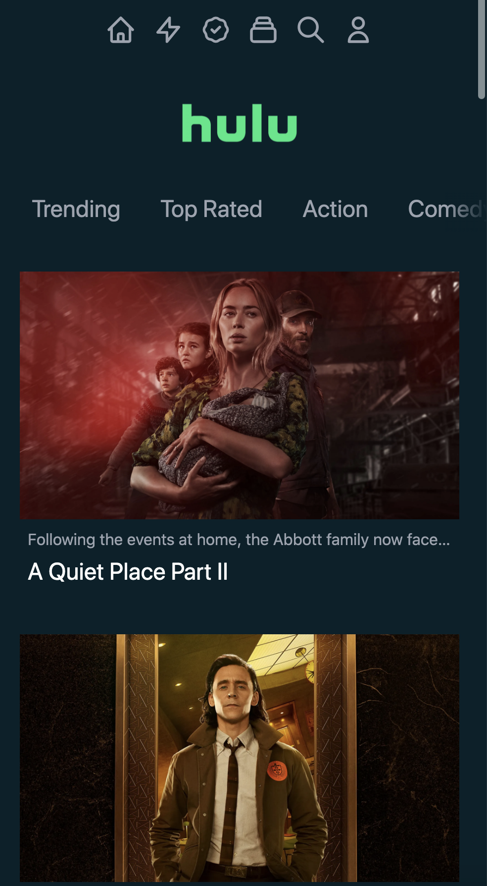

# Next.js + Tailwind CSS Hulu Clone

This is a simple clone of Hulu homepage using TMDB api for data

## Preview

Desktop view:


Mobile view:



You can visit a deployed version on this [link](https://next-hulu-rose.vercel.app/).

## Deploy your own

Deploy the example using [Vercel](https://vercel.com?utm_source=github&utm_medium=readme&utm_campaign=next-example):

[](https://vercel.com/new/git/external?repository-url=https://github.com/imperiumzigna/next_hulu&project-name=next-hulu&repository-name=next_hulu)

## How to use

1. Clone the repository

2. Install dependencies

```
npm install
```

3. Run the project

```
npm run dev
```

4. After build you should see the server running at http://localhost:3000

Deploy it to the cloud with [Vercel](https://vercel.com/new?utm_source=github&utm_medium=readme&utm_campaign=next-example) ([Documentation](https://nextjs.org/docs/deployment)).
